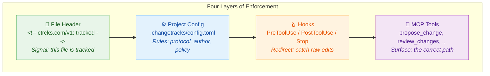
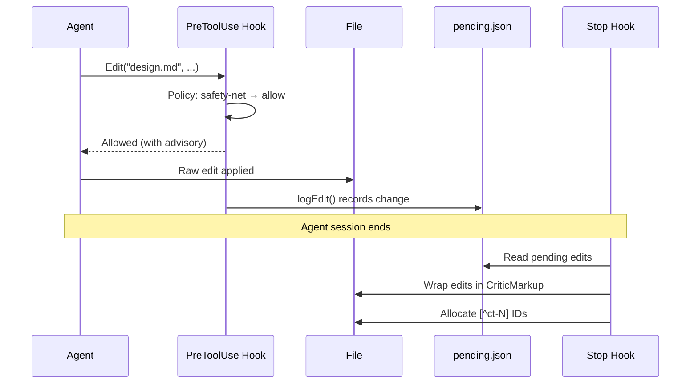
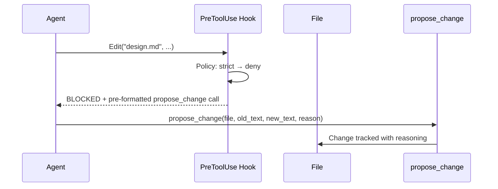

# How Track Changes Works

ChangeTracks is change tracking for text files. It provides insertions, deletions, substitutions, comments, and accept/reject — operations familiar from track changes in popular editors — but implemented as plain-text markup in files, designed for both humans and AI agents. Changes can carry both *what* changed and *why*, through inline markup and attached discussion threads — when authors provide reasoning.

The changes are written in [CriticMarkup](https://criticmarkup.com/), an open standard. Think of it as the text-file version of colored underlines and strikethroughs you see in popular editors:

| Type | Syntax | What it looks like |
|------|--------|--------------------|
| Insertion | `text` | `added paragraph` |
| Deletion | `` | `` |
| Substitution | `new` | `final` |
| Highlight | `text` | `important section` |
| Comment | `` | `` |

Each change gets a reference tag (like ``) that links to a record at the bottom of the file. This record shows who proposed the change, when, why, and any back-and-forth discussion. The footnote isn't a log of the collaboration — it *is* the collaboration. See [Glossary](glossary.md) for detailed term definitions.

## For Humans — The VS Code Experience

Install the ChangeTracks extension from the VS Code Marketplace (or Cursor's extension panel). The extension requires no additional runtime dependencies - no language server to install separately, no external binaries. Open a markdown file. Toggle tracking mode with **Shift+Cmd+E** — a dot icon appears in the editor title bar confirming tracking is active.

**Type naturally.** Every edit auto-wraps in CriticMarkup. The extension accumulates keystrokes and flushes them as a single change after a 30-second pause, a cursor move, or a file save. Cut/paste operations are detected as moves (displayed in purple with bidirectional navigation).

**Smart View** hides the change markup so the document reads as clean prose. When your cursor enters a change, the markup briefly appears (in italic gray) so you can see what was changed. When you move away, it hides again. You can turn Smart View off to see all markup at once.

### Key Commands

| Action | Keybinding |
|--------|------------|
| Toggle tracking | Shift+Cmd+E |
| Accept change | Shift+Cmd+A (or Cmd+Y when cursor is on a change) |
| Reject change | Shift+Cmd+R (or Cmd+N when cursor is on a change) |
| Next change | Shift+Cmd+] |
| Previous change | Shift+Cmd+[ |
| Add comment | Shift+Cmd+C |
| Show diff view | Shift+Cmd+D |
| Annotate from git | Shift+Cmd+G |  

All keyboard shortcuts shown are for Mac. On Windows/Linux, replace Cmd with Ctrl.

The sidebar panel shows project status, a change list (grouped flat, by author, or by type), toggles, and summary actions. Changes update in real time with an 80ms debounce.

The extension ships with a 5-step walkthrough (Welcome tab) that walks through project setup, author identity, tracking mode, and accept/reject practice on a demo file.

## For Agents - MCP Tools

ChangeTracks's agent integration currently supports **Claude Code** (via Claude Code plugin with hooks) and **Cursor** (via hooks adapter). The MCP server uses stdio transport, meaning any MCP-compatible agent framework can connect - but Claude Code and Cursor are the two with tested, shipped hook implementations.

AI agents interact with ChangeTracks through seven [MCP](https://modelcontextprotocol.io/) tools. The tools expose a propose/review workflow analogous to the human editor experience:

| Tool | Purpose |
|------|---------|
| `read_tracked_file` | See file content in three-zone format |
| `propose_change` | Make 1-N tracked changes (classic or compact) |
| `review_changes` | Batch approve/reject/request-changes + thread replies |
| `get_change` | Deep dive into one change (full thread, revision history) |
| `amend_change` | Revise own proposals (same-author enforcement) |
| `list_changes` | Lightweight inventory, filter by status |
| `supersede_change` | Replace another's proposal (atomic reject + propose) |

> **Current platform support:** The VS Code extension works in VS Code and Cursor. Editor plugins also exist for Neovim (Lua, feature-complete) and Sublime Text (beta). The MCP server is editor-agnostic - any agent that speaks MCP over stdio can connect. A standalone CLI (`sc`) provides status, diff, settle, and publish commands for CI/scripting use cases.

### What agents read

When an agent calls `read_tracked_file`, it gets a three-zone format:

```
 3:3f P| The service should use GraphQL[ct-4] for the external interface. 
 4:b2  | Rate limiting should be set to 1000 requests per minute.
```

**Zone 1 — Margin:** `LINE:HASH FLAG|` — coordinates for addressing and a P (proposed) or A (accepted) flag.
**Zone 2 — Content:** Committed text with CriticMarkup inline.
**Zone 3 — Metadata:** `` — summary at end of line.

The read teaches the write. The same operators (`~>`, `{>>`) that appear in the file view are the operators the agent uses to propose changes.

### Two protocol modes

**Classic protocol** — specify old and new text:
```
propose_change(
  file="design.md",
  old_text="REST",
  new_text="GraphQL",
  reason="External consumers need flexible queries"
)
```

**Compact protocol** — point at a hash-verified line address:
```
propose_change(
  file="design.md",
  at="3:3f",
  op="REST~>GraphQL{>>External consumers need flexible queries"
)
```

Classic works like find-and-replace. Compact uses the `LINE:HASH` coordinates from the margin zone — the hash verifies that the line content hasn't changed since the agent last read the file. Both modes are first-class. The choice is a project configuration decision, not a capability progression.

### Git interaction

ChangeTracks operates alongside git, not instead of it. Changes live in the file as CriticMarkup text - git sees them as normal text diffs. When you `git diff`, you see CriticMarkup syntax in the diff. When you `git log -p -S '[^ct-N]'`, you can trace a specific change through version history. There is no separate database, no sidecar files beyond `.changetracks/config.toml` and transient hook state. Accepted changes are compacted (markup removed, footnote status updated) by the `settle` command or the review tool's settle option - the result is a clean file that git commits as usual.

This means ChangeTracks adds a deliberation layer *above* git's what-changed layer: git records that line 47 changed, ChangeTracks records *why* and *who decided*.

### Four views

Agents select a view when reading a file:

| View | Shows | Use case |
|------|-------|----------|
| `review` | Full three-zone annotations | Understanding deliberation context |
| `changes` | Clean prose with P/A flags | Editing with minimal overhead |
| `settled` | Accept-all preview | Seeing what the final document looks like |
| `raw` | Literal file bytes | Debugging |

The first `read_tracked_file` call delivers a one-time editing guide showing protocol syntax, author requirements, and available views.

## Hospitality, Then Enforcement

ChangeTracks follows ADR-024: *environment over instruction*. Instead of telling agents what to do and hoping they comply, the system changes the environment so correct behavior is the path of least resistance. Four layers enforce this, from least invasive to most:



**Layer 1 - File header.** The `<!-- ctrcks.com/v1: tracked -->` comment on line 1 signals that a file is tracked. The header is the highest-precedence signal; it overrides project config and global defaults.

**Layer 2 - Project config.** `.changetracks/config.toml` sets project-wide rules: which files to track, whether authors are required, what protocol mode to use, and the enforcement level.

**Layer 3 - Hooks.** Three hooks intercept agent behavior at the point of action:
- **PreToolUse** — fires before an Edit or Write tool executes. In strict mode, blocks the edit and returns a pre-formatted `propose_change` call. Whether the agent submits it depends on the agent's behavior.
- **PostToolUse** — fires after an allowed edit. In safety-net mode, logs the raw edit to `.changetracks/pending.json`.
- **Stop** — fires when the agent session ends. Wraps any logged raw edits in CriticMarkup and allocates change IDs.

**Layer 4 - MCP tools.** The tools themselves are the correct path. When an agent uses `propose_change`, changes are tracked with full reasoning from the start. No hooks needed.

### The enforcement dial

The `[policy] mode` setting in `.changetracks/config.toml` controls how strictly the system redirects agents:

| Mode | Behavior |
|------|----------|
| **strict** | Raw Edit/Write is blocked. The hook returns `deny` with a pre-formatted `propose_change` call. The agent's edit does not reach the file. |
| **safety-net** | Raw Edit/Write is allowed but logged. At session end, the Stop hook wraps all logged edits in CriticMarkup. Reasoning is lost — the change is tracked but without the agent's explanation. |
| **permissive** | No interception. The agent writes directly. Use only for files that don't need tracking. |

### What ChangeTracks does NOT do

- **Not a merge tool.** ChangeTracks does not resolve git merge conflicts. If two people edit the same tracked file on different branches, git handles the merge; ChangeTracks markup is just text that git merges like any other text.
- **Not real-time collaboration.** There is no live multi-cursor, no operational transform, no CRDT. It is designed for asynchronous review workflows - one author proposes, another reviews.
- **Not a replacement for code review.** ChangeTracks tracks changes in prose/documentation. It does not parse programming languages, does not understand ASTs, and does not integrate with GitHub PR review flows.
- **Markdown only (v1).** The parser handles markdown files. Other plain-text formats are not yet supported. Binary files (images, PDFs) are out of scope.

## Safety Net — What Happens When Agents Slip Through

In safety-net mode, the system retroactively wraps raw edits in CriticMarkup at session end, though reasoning is lost when an agent uses raw Edit/Write instead of `propose_change`:



In strict mode, the flow is shorter — the edit never reaches the file:



## Performance

The core parser is single-pass O(n) - it scales linearly with file size. Edit boundary detection uses an 80ms debounce for decoration updates. The extension adds no measurable latency to normal typing when tracking is enabled; changes are flushed on pause (30-second default), cursor move, or save. For very large files (10,000+ lines of CriticMarkup), the footnote section grows proportionally, but the three-zone renderer processes lines independently.

## Settings

Three settings in `.changetracks/config.toml` control the agent experience:

| Setting | Values | Effect |
|---------|--------|--------|
| `[policy] mode` | `strict` / `safety-net` / `permissive` | How aggressively raw edits are intercepted |
| `[protocol] mode` | `classic` / `compact` | Which edit protocol agents use |
| `[author] enforcement` | `optional` / `required` | Whether changes must carry author identity |

Additional settings that affect agent behavior:

| Setting | Values | Effect |
|---------|--------|--------|
| `[protocol] reasoning` | `optional` / `required` | Whether changes must include a reason |
| `[policy] default_view` | `review` / `changes` / `settled` | Which view agents see by default |
| `[hashline] enabled` | `true` / `false` | Whether `LINE:HASH` coordinates appear in margin |

For the full configuration reference, see `.changetracks/config.toml` in any tracked project.

## Getting Started

1. **Install the extension** from VS Code Marketplace or Cursor's extension panel.
2. **Open a markdown file** and run **Shift+Cmd+E** to toggle tracking.
3. **Make edits** - they auto-wrap in CriticMarkup.
4. **Review changes** with **Shift+Cmd+A** (accept) or **Shift+Cmd+R** (reject).
5. **For agent integration,** install the Claude Code plugin from `changetracks-plugin/` and configure `.changetracks/config.toml`.

For term definitions, see [Glossary](glossary.md).
