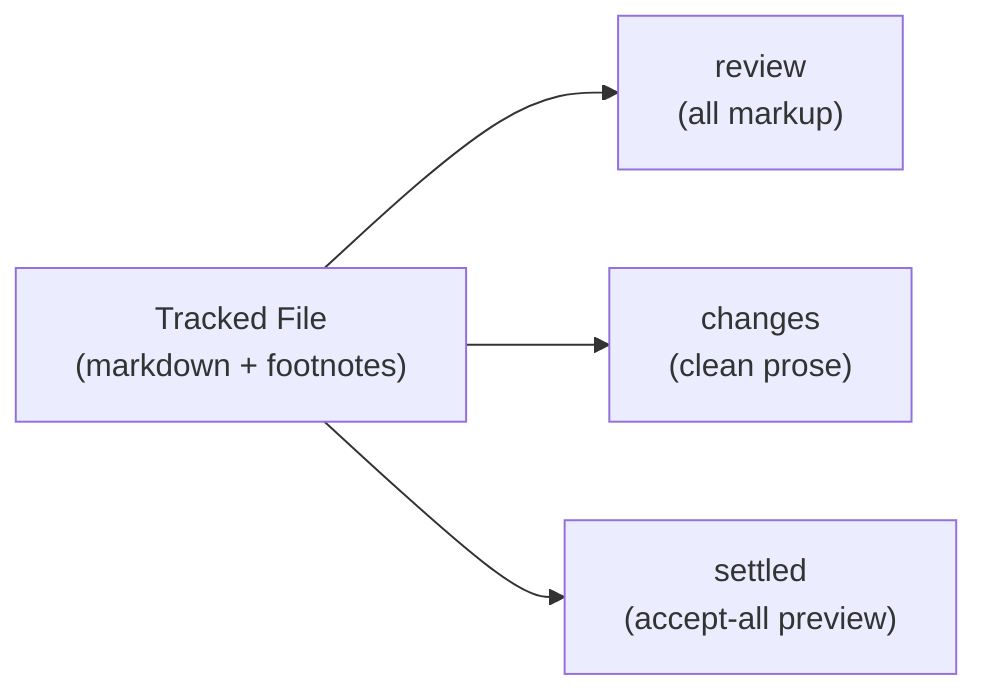
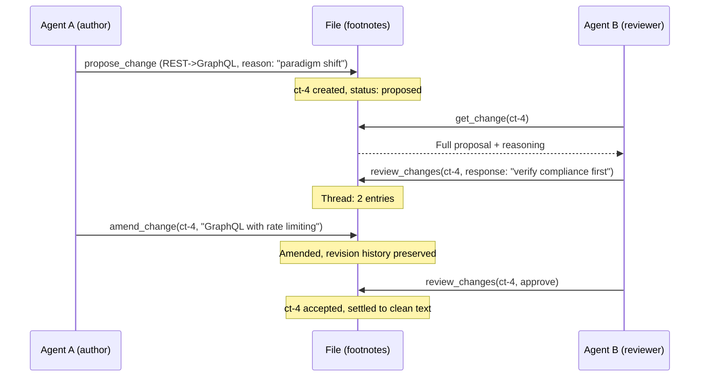

# How Views and Addressing Work

[How Track Changes Works](how-track-changes-works.md) covered what changes look like and how humans and agents use them. This document explains how the same [tracked file](glossary.md) looks different depending on who is reading it and what they are doing -- and how multiple authors edit concurrently without stepping on each other.

A tracked file has three parts: (1) a tracking header on line 1 (an HTML comment that marks the file as tracked), (2) content with inline [CriticMarkup](glossary.md) markup showing what changed, and (3) [footnotes](glossary.md) at the bottom carrying the deliberation record (who proposed each change, why, and what was discussed). That is everything. There is no database, no server state that outlives the process. Everything else -- the views described below, the margin hashes, the flags -- is a projection computed on read from the file as source of truth.

## Three Views

ChangeTracks provides four views of the same tracked file. Each view is a computed projection that omits, summarizes, or restructures information depending on what you need. Unlike visual toggles that just change rendering, these views can produce entirely different output from the same source file.

| View | Alias | What you see |
|------|-------|--------------|
| `review` | `all` | Everything -- markup, authors, reasoning, discussion counts |
| `changes` | `simple` | Clean prose with a single-character flag (`P` or `A`) in the margin showing where changes exist |
| `settled` | `final` | Accept-all preview -- the document as it would read if every pending proposal were approved |
| `raw` | `content` | Literal file bytes with all CriticMarkup and footnotes visible |

### Seeing it in action

Here is the same line of a document shown in all three views. Someone proposed changing "REST" to "GraphQL" with a reason attached:

**review:**
```
 3:a7 P| The API should use GraphQL[ct-4] for the external interface. 
```

**changes:**
```
 3:a7 P| The API should use REST for the external interface.
```

**settled:**
```
 3:a7  | The API should use GraphQL for the external interface.
```

One file, three projections. The markup exists once on disk. The view determines what you see.



### When to use each view

**review** -- The reviewing [surface](glossary.md). You see every proposed change in context with full CriticMarkup, the author who proposed it, their reasoning, and how much discussion has happened. This is where you make accept/reject decisions. The annotations add roughly 600 tokens per read compared to `changes` -- for AI agents, those extra tokens are signal when evaluating proposals; for humans in VS Code, the visual overhead is minimal.

**changes** -- The editing surface. You see clean prose with a single-character flag in the margin: `P` for pending proposal, `A` for recently accepted change, blank for no activity. The `P` flag says "something happened here" without showing what. This is the "fresh eyes" view. You form your own judgment about the prose without being influenced by what others proposed. In early benchmark testing (two models, small sample sizes), some AI models appeared to defer to existing proposals when they could see them; the `changes` view is designed to prevent that bias.

**settled** -- The coherence-check surface. Every pending proposal is applied (accepted) in this projection. You read the document as it would exist after approval and ask: does this still flow? Are there contradictions? Any regressions introduced by the proposed changes? Use this before batch-approving a set of proposals.

**raw** -- Diagnostic view. Shows the literal file content including all CriticMarkup delimiters, footnote references, and the full footnote section. Useful for debugging and direct file inspection. Not designed for editing.

### How to access views

**Humans:** In the VS Code extension, use the Smart View toggle in the editor toolbar. You can also open the file in any text editor -- the CriticMarkup syntax is plain text.

**Agents:** Call `read_tracked_file(file, view="review")`. The `view` parameter selects the projection. The default is `review`. All four names and their aliases are valid: `review`/`all`, `changes`/`simple`, `settled`/`final`, `raw`/`content`.

## The Three-Zone Line Format

Each view presents lines with a consistent three-zone structure. Here is the `review` view broken down:

```
MARGIN            | CONTENT                                                                     | METADATA
 3:a7 P            | The API should use GraphQL[ct-4] for the external interface.    | 
```

**Margin** (Zone 1) -- `LINE:HASH FLAG|`. The line number, a 2-character content hash, an optional flag, and a pipe separator. This is addressing information, not content. The margin is the coordinate space -- it tells you where you are and whether anything is happening on this line.

**Content** (Zone 2) -- The text with inline CriticMarkup showing what is changing and where. Each change has an `[ct-N]` anchor linking it to the metadata at the end of the line. CriticMarkup delimiters (`service[ct-1] should use GraphQL[ct-5] for the external interface. 
```

Correspondence between anchors and metadata blocks is explicit via change ID. The order of metadata blocks mirrors the order of anchors in the content.

## Hash Addressing

### The problem with line numbers

Line numbers are fragile in collaborative editing. Consider: Agent A reads line 47 and plans an edit. Meanwhile, another agent's change at line 30 gets accepted, adding 3 new lines. Line 47 is now line 50. If Agent A submits its edit targeting "line 47," it hits the wrong text.

This is not hypothetical -- it is a well-known addressing problem in concurrent editing systems.

### How LINE:HASH works

Every line gets a 2-character hash computed from its content. The algorithm strips trailing carriage returns and footnote references (`[^ct-N]` anchors) from the line, then removes all whitespace. xxHash32 (a fast, non-cryptographic hash function) is applied to the resulting UTF-8 bytes, taken modulo 256 and formatted as lowercase hex. An agent addresses lines as `LINE:HASH` -- for example, `47:a3`.

When an agent proposes an edit at `47:a3`, the server checks: does line 47 still have hash `a3`? If yes, proceed. If no, reject with a clear error.

The hash is a content fingerprint. Same text always produces the same hash. Different text almost always produces a different hash. Two characters give 256 possible values -- enough to catch accidental edits with high probability, compact enough to fit in a margin without visual noise. When two different non-blank lines do hash to the same value (a 1-in-256 collision), the LINE:HASH pair is still unique because the line number disambiguates -- collisions only matter if the same line number has different content that happens to produce the same hash, which requires an edit that the hash was specifically designed to detect.

### Staleness detection -- the safety guarantee

Walk through a concrete multi-agent scenario:

1. Agent A reads the file. Line 12 shows `12:5f | The API uses REST.`
2. Agent B proposes changing "REST" to "GraphQL" -- the change is accepted and settled.
3. Line 12 now reads `12:7b | The API uses GraphQL.`
4. Agent A, working from its earlier read, tries to edit `12:5f`.
5. The server checks line 12 and finds hash `7b`, not `5f`. **Mismatch detected.**
6. Agent A gets an error with context and a recovery path (see below).
7. Agent A re-reads the file, gets fresh coordinates, and retries successfully.

**The guarantee: you cannot accidentally edit text you have not read.**

This matters because in multi-agent workflows, multiple agents read and propose changes concurrently. Without staleness detection, Agent A's edit would silently target text that no longer exists -- or worse, text that has been replaced with something semantically different. With it, such conflicts are caught with high probability (though not with certainty, since the 2-character hash has 256 possible values).

### What a mismatch error looks like

When a hash does not match, the server returns a structured error with surrounding context, the mismatched lines highlighted, and a suggested fix:

```
Hashline mismatch:
    10:c8|Error responses should include a message in the body.
    11:00|
>>> 12:7b|The API uses GraphQL.
    13:00|
    14:a3|Rate limiting applies to all endpoints.

Quick-fix remaps:
  12:5f → 12:7b

Re-read the file with read_tracked_file to get updated coordinates.
```

The `>>>` prefix marks the mismatched line. The quick-fix remap shows what the hash changed to. The recovery instruction is explicit: re-read, get fresh coordinates, retry. This is a designed recovery path, not a crash.

### Batching and coordinate stability

An agent can read the file once and propose many changes in a single batch. All coordinates from that one read remain valid because:

- Hashes are computed on the committed text (the stable base text), not on transient markup
- Proposals do not shift line numbers for other proposals in the same batch
- The server applies the batch atomically

Example: an agent reads once, finds 15 issues across the document, and submits them all in one `propose_change` call with a `changes` array. One read, one write, 15 edits. All coordinates in a batch reference the pre-change state of the file -- the server resolves them atomically, so edits within the same batch cannot interfere with each other's line numbers or hashes. [Benchmark data](how-changetracks-is-benchmarked.md) showed this pattern achieving ~8x fewer tool calls compared to the baseline workflow on one task (Sonnet 4.5 medians on task8: 3 tool calls vs 25; N=3 runs per surface).

### The blank-line problem

Every blank line contains the same content: nothing. If the hash function only considered the line's own text, every blank line in the document would hash to the same value. In practice, benchmark testing revealed one model (Minimax M2.5) latching onto repeated blank-line hashes -- a "hash attractor" effect where the agent would reference the wrong blank line because all blank lines looked identical in the coordinate space. Sonnet 4.5 was unaffected.

ChangeTracks solves this with structural context. When hashing a blank line, the algorithm incorporates the stripped content of the nearest non-blank line above, the stripped content of the nearest non-blank line below, and the distance from the nearest non-blank line above. This gives each blank line a unique hash based on where it sits in the document's structure. The computation stays O(n) for the full document because all lines are pre-computed in a single pass.

## Multi-Author Collaboration

### Author identity

Every change carries an author. Human authors use plain names (`@alice`, `@bob`). AI agent authors use the `ai:` namespace (`@ai:claude-opus-4.6`, `@ai:sonnet-4.5`). The namespace makes it immediately visible whether a change was proposed by a human or an agent.

Author enforcement is configurable per project in `.changetracks/config.toml`:

```toml
[author]
enforcement = "optional"   # "optional" (default) | "required"
default = "ai:claude-opus-4.6"
```

When set to `required`, every propose and review operation must include an author identity. When `optional` (the default), the server accepts operations without an explicit author and falls back to the configured `default` value. Note: the default `default` is an empty string, so a fresh project with no config customization will show empty author fields until configured.

### The propose, discuss, resolve cycle

The three views support distinct roles in collaboration:

- A **reviewer** works in `review` view. They see full proposals with reasoning and discussion threads. They have the context needed to make approve/reject decisions.
- A **copy-editor** works in `changes` view. They see clean prose with `P` flags. They edit independently, catching issues that the original proposer missed. The `P` flags prevent collisions without creating deference.
- A **coordinator** works in `review` view. They see all threads across the document, make resolution decisions, and settle changes.

### Cross-review

Multiple agents can review each other's proposals. Agent B reads Agent A's proposal via `get_change`, which returns the full old text, new text, reasoning, discussion thread, and amendment history. Agent B responds in the discussion thread with evidence or counterarguments via `review_changes`. The discussion lives in [footnotes](glossary.md) -- same file, no external system.

### Amendment

The original author can amend their own proposal based on feedback -- updating the proposed text while preserving the full revision history. Cross-author amendment is blocked: you can discuss someone else's proposal and you can approve or reject it, but you cannot rewrite it. To replace someone else's proposal with a different approach, use `supersede_change`, which atomically rejects the old proposal and creates a new one.



## Why It All Lives in the File

There is no database behind ChangeTracks. No server state that outlives the process. The [footnotes](glossary.md) at the bottom of the file ARE the deliberation record -- who proposed what, when, why, what was discussed, and how it was resolved.

The views are projections computed on read. The file is always the source of truth.

This has a concrete consequence for history. Run:

```bash
git log -p -S '' --all
```

This reconstructs the full lifecycle of change `ct-4` -- when it was proposed, who reviewed it, what was discussed, when it was resolved. The search works because git's `-S` flag uses fixed-string matching by default (not regex), so `` is matched literally as the footnote reference -- the `[^` is not interpreted as a regex negation character class. No special git configuration is required beyond a standard repository with history.

This is what distinguishes ChangeTracks from Google Docs suggestions, GitHub PR reviews, and similar systems where the discussion lives in a separate database. In those systems, the reasoning is accessed through that system's interface. Here, the reasoning travels with the text. Move the file to a different repository, a different editor, a different machine -- the deliberation record comes along. It is plain markdown all the way down.

See the [Glossary](glossary.md) for term definitions, [How Track Changes Works](how-track-changes-works.md) for CriticMarkup basics, [How ChangeTracks Is Tested](how-changetracks-is-tested.md) for the testing strategy, and [How ChangeTracks Is Benchmarked](how-changetracks-is-benchmarked.md) for performance data behind the efficiency claims in this document.
# Read /tmp/rehead/6008bdb1d194c058.txt instead of re-running
